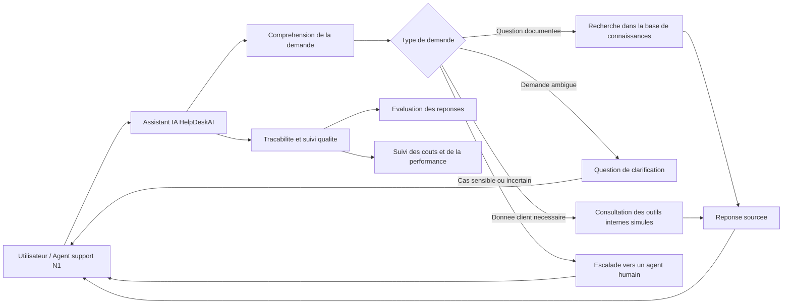

# Architecture HelpDeskAI

## Architecture fonctionnelle cible V1

Le schema ci-dessous presente la vision fonctionnelle de HelpDeskAI.
Il ne detaille pas les composants techniques, mais illustre les grands roles du
systeme : comprendre la demande, rechercher dans la base documentaire, consulter
les outils internes simules si necessaire, repondre avec sources, demander une
clarification ou escalader vers un humain.



## Statut

Architecture cible en cours de construction par phases. Les elements ci-dessous
documentent l'etat actuel du module d'ingestion et ses frontieres avec les
modules suivants.

## Contexte

HelpDeskAI vise a assister un support N1 NovaCloud avec des reponses sourcees,
des outils internes simules, une logique d'escalade et un suivi qualite.

## Architecture cible

Un diagramme C4 niveau 2 sera complete lorsque les composants Retrieval, RAG,
Agents, MCP et Observabilite seront stabilises.

## Composants

| Composant | Responsabilite | Technologie / statut |
| --- | --- | --- |
| Ingestion | Pipeline modulaire `extract -> normalize -> document dedup -> enrich -> chunk recursive -> chunk dedup -> persist -> quality` applique uniquement aux documents TechQA. Il produit les documents canoniques et les chunks prets pour l'indexation. Les questions/reponses TechQA, Bitext et MSDialog restent hors pipeline. | Python, BeautifulSoup, tokenizer BGE-M3, Prefect, Evidently. Implemente dans `helpdeskai.ingestion` et expose par `scripts/prepare_corpus.py`. |
| Analyse corpus | Analyse exploratoire des corpus bruts et comparaison independante des strategies de chunking. Ces scripts produisent des artefacts de decision, pas des donnees indexees. | Python, Pandas, Matplotlib, BGE-M3 pour le chunking semantique. Expose par `scripts/analyze_corpus.py` et `scripts/compare_chunking.py`. |
| Retrieval | Indexation des chunks TechQA dans Qdrant et pgvector. Recherche dense via embeddings BGE-M3, recherche sparse BM25 locale, recherche hybride par Reciprocal Rank Fusion, filtres metadata produit/version/date/tenant. | Python, SentenceTransformers, Qdrant, PostgreSQL/pgvector, BM25. Implemente dans `helpdeskai.retrieval` et expose par `scripts/index_retrieval.py`, `scripts/benchmark_retrieval.py` et `helpdeskai.retrieval.search.search`. |
| RAG | A definir | A definir |
| Agent | A definir | A definir |
| Serveurs MCP | A definir | A definir |
| Observabilite | A definir | A definir |

## Flux de donnees

```text
scripts/download_corpus.py
    -> data/raw/techqa/documents.jsonl
    -> data/raw/techqa/qa.jsonl
    -> data/raw/bitext/tickets.jsonl
    -> data/raw/msdialog/conversations.jsonl

scripts/prepare_corpus.py
    -> data/processed/techqa/documents.jsonl
    -> data/processed/techqa/chunks.jsonl
    -> data/processed/techqa/manifest.json
    -> docs/corpus_preparation/corpus_quality_report.html
    -> docs/corpus_preparation/corpus_quality_summary.json

scripts/compare_chunking.py
    -> docs/corpus_preparation/chunking_benchmark.json
    -> docs/corpus_preparation/chunking_benchmark.md
    -> docs/corpus_preparation/chunking_comparison.png

scripts/index_retrieval.py
    -> Qdrant collection helpdeskai_techqa_chunks
    -> pgvector table retrieval_chunks

helpdeskai.retrieval.search.search
    -> dense search via Qdrant
    -> sparse search via BM25
    -> hybrid search via Reciprocal Rank Fusion

scripts/benchmark_retrieval.py
    -> reports/retrieval/benchmark_results.csv
    -> reports/retrieval/benchmark_report.md
```

Seuls les chunks issus de `data/processed/techqa/chunks.jsonl` sont destines a
l'indexation vectorielle. Les Q/A TechQA servent aux evaluations RAG, Bitext aux
tests d'intention et demonstrations, MSDialog aux tests multi-tours.

## Exigences non fonctionnelles

- Securite : a definir.
- Performance : a definir.
- Disponibilite : a definir.
- Observabilite : a definir.
- FinOps : a definir.

## Decisions d'architecture

Consigner les decisions importantes dans des ADR dedies.
