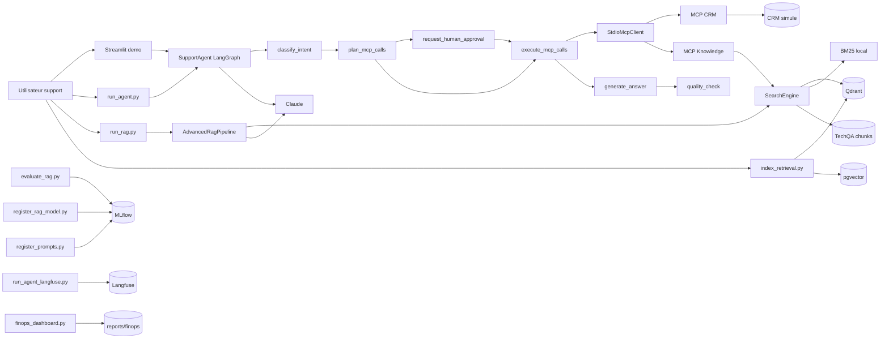
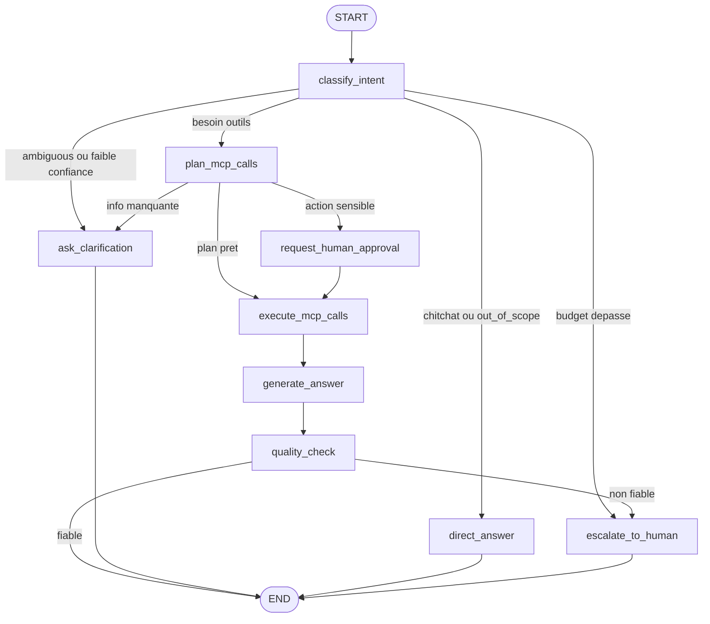

# Architecture HelpDeskAI

## Perimetre

HelpDeskAI est un POC local d'assistant support N1. Le flux couvert est :

```text
ingestion -> retrieval -> RAG -> agent -> MCP -> observabilite
```

Le systeme s'execute avec `uv` pour les scripts Python et Docker Compose pour
Qdrant, pgvector, MLflow, Langfuse et la demo Streamlit.

## Vue Technique



## Graphe Agent

Ce diagramme correspond aux noeuds et routes declares dans
`helpdeskai/agents/support_agent.py`.



## Composants

| Composant | Role | Implementation |
| --- | --- | --- |
| Ingestion | Prepare les documents TechQA indexables. | `helpdeskai.ingestion`, `scripts/prepare_corpus.py` |
| Retrieval | Recherche dense Qdrant, sparse BM25 et hybride par fusion. pgvector est alimente par l'indexation mais n'est pas le chemin de recherche public actuel. | `helpdeskai.retrieval`, Qdrant, BM25, pgvector |
| RAG | Rewrite, retrieve, rerank, compress, generate. | `helpdeskai.rag`, `scripts/run_rag.py` |
| Agent | Orchestre classification, outils MCP, HITL et qualite. | `helpdeskai.agents.support_agent` |
| MCP CRM | Donnees client, abonnement et creation de ticket. | `helpdeskai.mcp_servers.crm` |
| MCP Knowledge | Outil `search_knowledge` branche sur retrieval. | `helpdeskai.mcp_servers.knowledge` |
| Demo | Chat local et validation d'action sensible. | `scripts/demo_streamlit.py` |
| Observabilite | Evaluations, registry, traces et FinOps. | MLflow, Langfuse, `helpdeskai.observability` |

## Flux De Donnees

```text
scripts/download_corpus.py
    -> data/raw/

scripts/prepare_corpus.py
    -> data/processed/techqa/documents.jsonl
    -> data/processed/techqa/chunks.jsonl
    -> data/processed/techqa/manifest.json

scripts/index_retrieval.py
    -> Qdrant collection helpdeskai_techqa_chunks
    -> pgvector table retrieval_chunks

MCP Knowledge search_knowledge
    -> helpdeskai.retrieval.search.search(...)
    -> Qdrant en dense, BM25 en sparse, Qdrant + BM25 en hybrid

pgvector
    -> alimente par scripts/index_retrieval.py
    -> conserve comme stockage vectoriel comparatif

scripts/evaluate_rag.py
    -> reports/rag/
    -> MLflow si tracking URI configure

scripts/register_rag_model.py
    -> MLflow pyfunc model helpdeskai-rag-chain
    -> alias production par defaut
```
