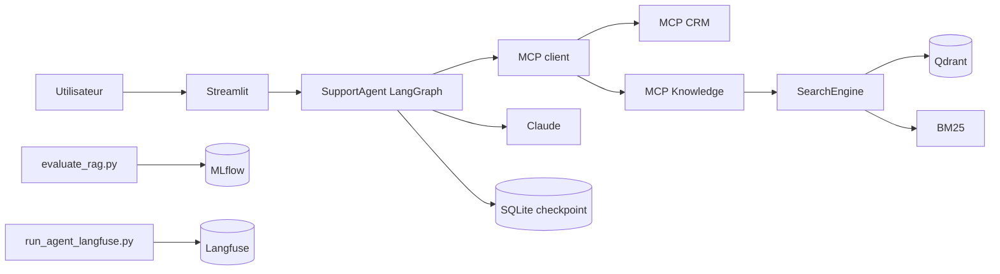
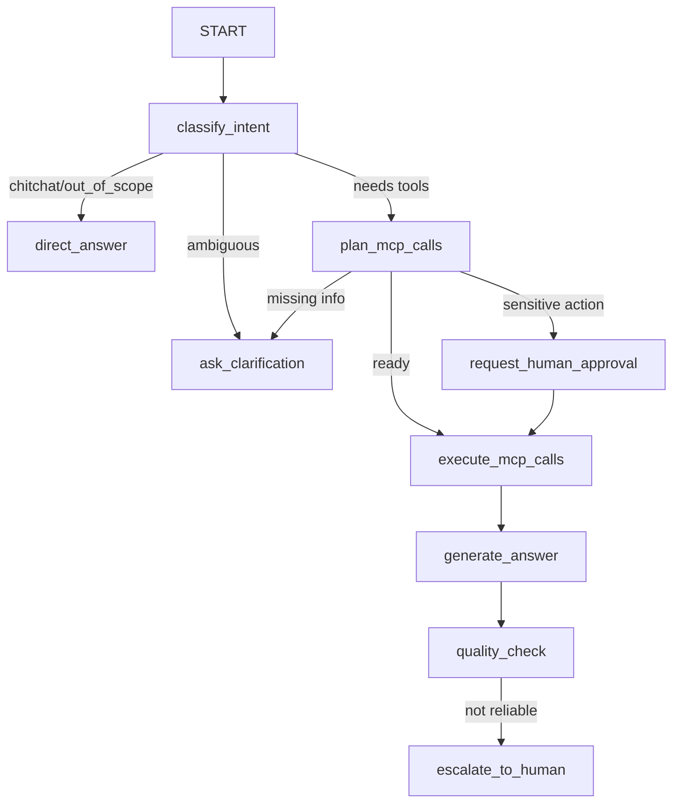



<style>
section {
  font-family: "Inter", "Segoe UI", Arial, sans-serif
}
section {
  color: #18212f
}
h1, h2 {
  color: #12355b
}
code, pre {
  font-size: 0.76em
}
table {
  font-size: 0.72em
}
.small {
  font-size: 0.72em
}
.cols {
  display: grid
}
.cols {
  grid-template-columns: 1fr 1fr
}
.cols {
  gap: 28px
}
.note {
  border-left: 5px solid #2d6cdf
}
.note {
  padding-left: 16px
}
.note {
  color: #31445f
}
</style>

# HelpDeskAI

Assistant support N1 augmente par RAG, agent LangGraph, MCP et observabilite.

Support de presentation final.

---

## Contexte Et Objectif

NovaCloud :

- editeur SaaS B2B 
- 12 000 entreprises clientes 
- 80 000 utilisateurs finaux 
- 1 800 tickets support par semaine 
- 60 % de questions repetitives deja documentees.

Probleme initial :

- hallucinations sur versions et procedures 
- citations inventees ou non verifiables 
- absence de logs, d'evaluation et de controle des couts.

Objectif HelpDeskAI :

```text
ingestion -> retrieval -> RAG -> agent -> MCP -> observabilite
```

---

## Perimetre Du Projet

Inclus :

- demo locale Streamlit 
- stack Docker Compose 
- TechQA, Bitext, MSDialog 
- Qdrant, pgvector, MLflow, Langfuse 
- CRM simule et Knowledge MCP 
- CI, tests et documentation.

Hors perimetre :

- UI produit finale 
- fine-tuning 
- Kubernetes ou multi-region 
- integration SI reelle.

---

## Choix Techniques

| Besoin | Choix |
| --- | --- |
| Runner projet | `uv` |
| Recherche vectorielle | Qdrant |
| Comparaison vectorielle | pgvector |
| Recherche lexicale | BM25 |
| Embeddings | BGE-M3 |
| Agent | LangGraph |
| Integration outils | MCP |
| Observabilite | MLflow + Langfuse |
| LLM | Claude |

---

## Donnees Et Preparation

Sources :

- TechQA : documents techniques pour RAG 
- Bitext : intents support 
- MSDialog : scenarios multi-tours.

Pipeline :

```text
download_corpus.py
  -> prepare_corpus.py
  -> documents.jsonl + chunks.jsonl + manifest.json
  -> index_retrieval.py
```

Artefacts : `docs/corpus_preparation/`.

---

## Chunking Et Qualite Corpus

Source : `docs/corpus_preparation/chunking_benchmark.md`

Comparaison deterministe sur 50 documents TechQA :

| Strategy | Chunks | Mean tokens | Median | Min | Max | Duplicates | Runtime |
| --- | ---: | ---: | ---: | ---: | ---: | ---: | ---: |
| fixed | 184 | 321.70 | 384 | 12 | 384 | 0 | 1.25 s |
| recursive | 173 | 317.23 | 364 | 61 | 384 | 0 | 1.18 s |
| semantic | 206 | 247.54 | 211 | 3 | 512 | 7 | 752.67 s |

Strategie retenue : `recursive`.

---

## Retrieval Et Benchmark

Modes exposes :

- dense : BGE-M3 + Qdrant 
- sparse : BM25 
- hybrid : Reciprocal Rank Fusion.

Source : `reports/retrieval/benchmark_report.md`

| Mode | Recall@5 | Recall@10 | MRR | p95 ms |
| --- | ---: | ---: | ---: | ---: |
| dense | 0.3867 | 0.4267 | 0.3556 | 324.60 |
| sparse | 0.4133 | 0.4267 | 0.4067 | 224.46 |
| hybrid | 0.4133 | 0.4533 | 0.4005 | 420.37 |

---

## RAG Avance

Pipeline :

```text
question
  -> query rewriting
  -> retrieval hybrid
  -> reranking
  -> contextual compression
  -> generation LLM avec citations
```

Prompts versionnes :

- `strict` 
- `pedagogical` 
- `concise`.

---

## Architecture End-To-End



Reference : `docs/ARCHITECTURE.md`.

---

## Graphe Agent Et Planification



`plan_mcp_calls` transforme l'intention en appels MCP ordonnes.

---

## MCP Et Integration SI

CRM MCP :

- `get_customer`
- `get_subscription_status`
- `list_recent_tickets`
- `create_ticket`

Knowledge MCP :

- `search_knowledge`

Controles implementes :

- token d'authentification 
- validation stricte des entrees 
- audit JSONL 
- separation agent / outils SI.

---

## Demo Streamlit

Scenarios a montrer :

1. Question RAG technique.
2. Question CRM : `Quel est le statut de cust_acme ?`
3. Action sensible avec approbation humaine.
4. Reprise apres checkpoint avec le meme `thread_id`.

La demo affiche :

- reponse finale 
- chemin agent 
- intent et confiance 
- action en attente 
- details des appels MCP.

---

## Preuve : Chemin Agent

Question technique :

```text
classify_intent
  -> plan_mcp_calls
  -> execute_mcp_calls
  -> generate_answer
  -> quality_check
```

Action sensible :

```text
classify_intent
  -> plan_mcp_calls
  -> request_human_approval
  -> execute_mcp_calls
  -> generate_answer
```

Ces chemins sont visibles dans Streamlit et l'etat LangGraph.

---

## Preuve : Logs MCP

CRM, source `data/audit/mcp-crm.jsonl` :

```json
{"tool":"get_subscription_status","actor_id":"streamlit_demo",
"args":{"customer_id":"cust_acme"},"result":"success","duration_ms":2}
```

Knowledge, source `data/audit/mcp-knowledge.jsonl` :

```json
{"tool":"search_knowledge","actor_id":"streamlit_demo",
"args":{"query":"How do I configure queue watcher parameters in IBM Sterling B2B Integrator?",
"top_k":5},"result":"success","duration_ms":23145}
```

Les logs relient acteur, outil, arguments, resultat et latence.

Details utilisables en Q/R : `docs/presentation/logs_traces_examples.md`.

---

## Observabilite

MLflow :

- evaluations RAG 
- prompt registry 
- model registry pyfunc 
- parametres, metriques, artefacts.

Langfuse :

- trace conversationnelle 
- appels LLM 
- latences 
- couts par requete quand disponibles.

MinIO :

- stockage objet local pour Langfuse v3.

Trace Langfuse a capturer : `docs/presentation/assets/langfuse-agent-trace.png`.

---

## Captures

 `docs/presentation/assets/` :

- `streamlit-chat-rag.png`
- `streamlit-hitl-approval.png`
- `langfuse-agent-trace.png`
- `mlflow-prompt-registry.png`
- `qdrant-collection-status.png`


---

## FinOps

Source : `docs/FINOPS.md`

| Variante | Cout/mois 10k req. | Cout/requete | Projection 7 800 req./mois |
| --- | ---: | ---: | ---: |
| Sans optimisations | $247.00 | $0.02470 | $192.66 |
| Solution actuelle estimee | $199.00 | $0.01990 | $155.22 |
| Cible optimisee | $141.16 | $0.01412 | $110.14 |

Leviers :

- compression du contexte 
- routage modele 
- prompt caching 
- cache semantique 
- evaluation sur echantillon.

---

## Securite Et Risques

Risques :

- hallucination ou citation incorrecte 
- prompt injection dans documents 
- fuite de donnees client 
- indisponibilite LLM ou Langfuse 
- evaluation biaisee par golden dataset ambigu.

Mitigations :

- citations obligatoires 
- validation humaine 
- audit MCP 
- traces et logs 
- fallback/escalade humaine.

---

## CI Et Reproductibilite

Commandes principales :

```bash
uv sync --dev
docker compose up --build -d
uv run pytest
uv run ruff check .
```

Demo :

```bash
uv run streamlit run scripts/demo_streamlit.py
```

Benchmark retrieval :

```bash
uv run python scripts/benchmark_retrieval.py
```

---


